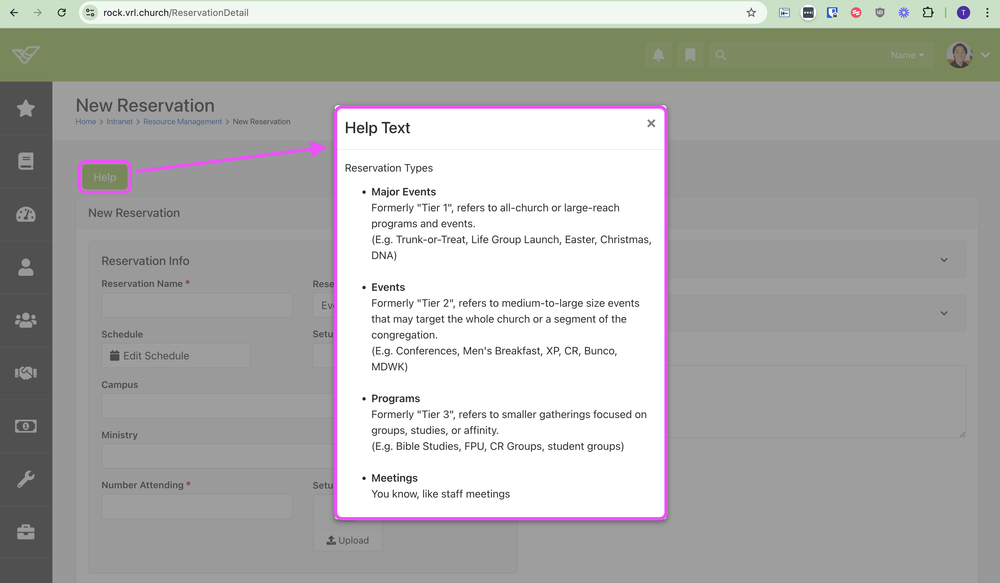

# BlockId 4486
This Block contains HTML, JavaScript, and Lava that adds various QOL features to PageId=930

## Help Text : Reference Reservation Types
The modal contains a reference as to what each of the Reservation Types mean.
(The Reservation Types are configured [here](https://rock.vrl.church/page/938))

## Button : Change Reservation Type
The **Reservation Detail** Block does not allow user to update ReservationType. Therefore, I configured a Workflow Form that will take ReservationId and ReservationTypeId as input, and update the [ReservationTypeId] of the corresponding [Reservation]

I am also using JavaScript in order to display this button next to the existing "Edit" button