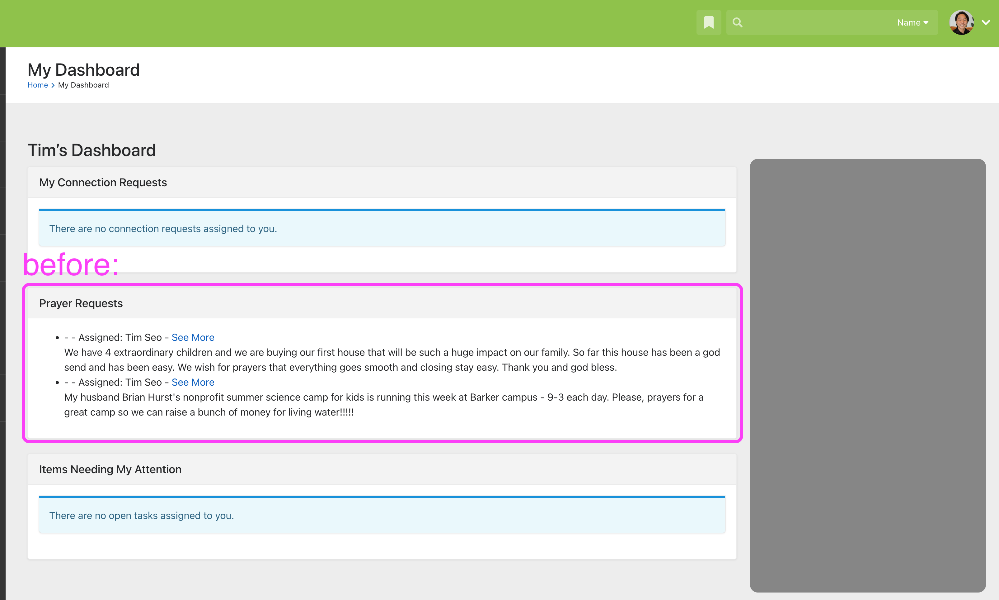
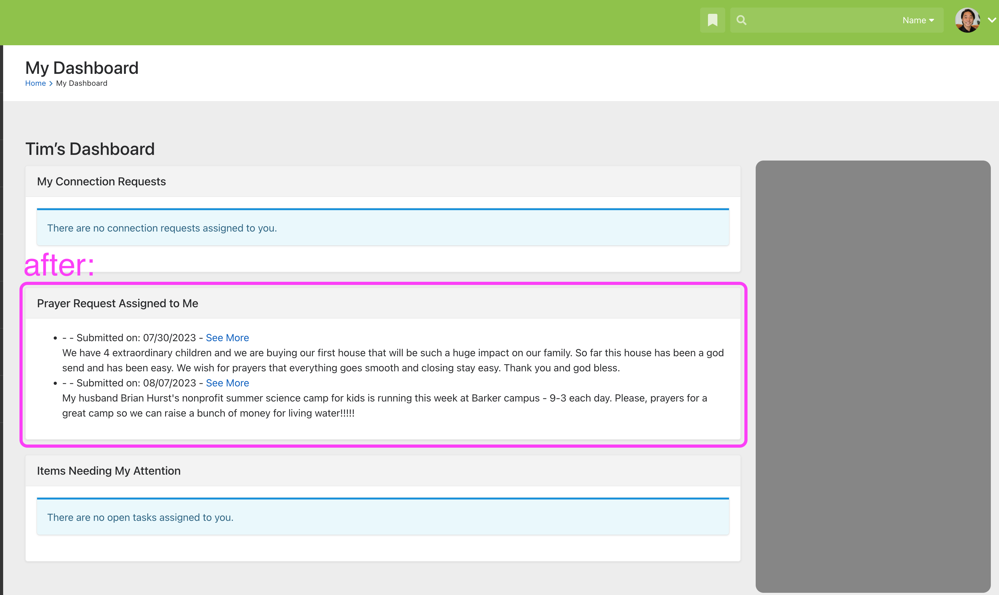

# Prayer Request List Lava
This is a very minor change.

When I first arrived at VRL, the Prayer Request List in our Dashboards had an unordered list of all prayers assigned to CurrentPerson. 
The downside was that each line item said, "Assigned to Current.Person". And this wasn't super hepful. 
So we changed a line in the Lava Template in order to go from this: 

to this: 
