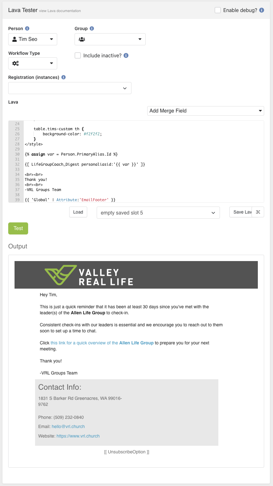
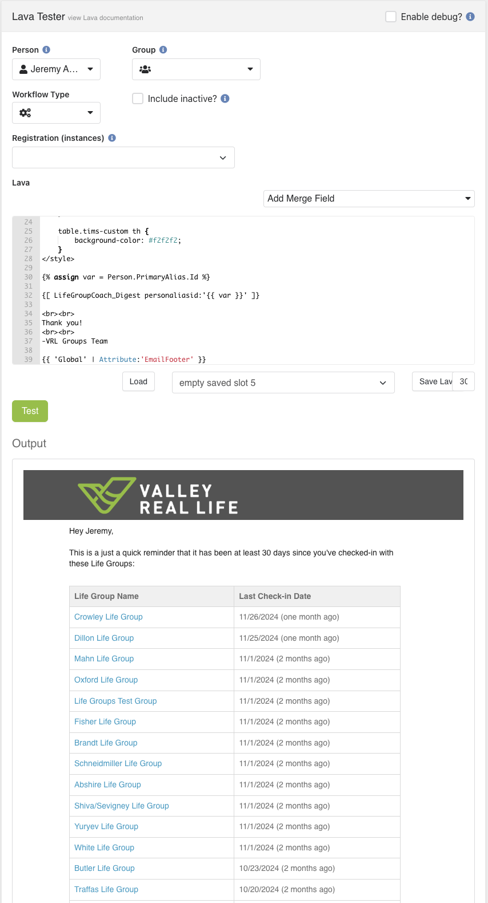

# ShortCode 59
# SQL for LG Coach Reminder 77
This Lava ShortCode exists because [SystemCommunicationId:77](../../EmailTemplates/SystemCommunicationId-77/SystemCommunicationId-77) would have needed SQL to populate its Email Body.

In order not to enable SQL at a global level, i took the approach of containerizing the SQL within this ShortCode, and enabling the 'SQL' Lava Command at the ShortCode level.

This ShortCode requires 'personaliasid' as input.

It is assumed that the corresponding Person is designated as a 'Coach' for a 'Life Group'1

From the PersonId as input, this Lava will run a SQL query to return any Life Groups that are overdue2 for Check-in3.

## Example Output
If the given PersonId has more than 1 overdue check-in, this ShortCode will output a table. Otherwise, it will output a paragraph. Either way, there will be a link to the 'Groups Toolbox' in the External Site ([reference](../../Block-HTMLContent/CoachingGroups_PageId1128/README.md)).

## Definitions:
1The definition of "Life Group" in this context is any Group that has been tagged with TagId:20
2The definition of "overdue" is 30 days. Therefore, we are checking for any Life Groups for whom their most-recent Check-in was >=30 days ago.
3After a Coach checks-in with a Life Group, they submit a Workflow Form that creates a ContentChannelItem. Therefore, "overdue for checkin" would mean that the most-recent ContentChannelItem associated with this Group has a `StartDate` of >=30 days ago.