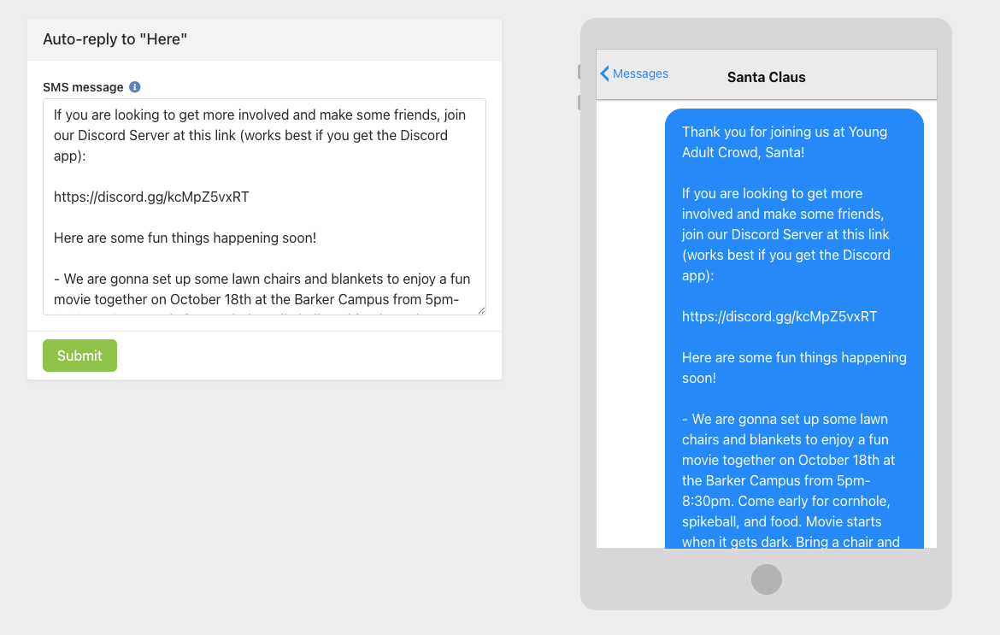

# Show the End-User what their scheduled SMS might look like
Most SMS are being generated either via Rock's communication wizard or Clearstream. Both of those options have their own preview.

There was this one time where I wanted to make it easier for a staff member to manage the auto-reply of their own Clearstream phone number. I copied the HTML from Rock's communication wizard in order to create this preview.

i foresee configuring something similar for other niche scenarios, like the Special Needs Ministry or Local Outreach Ministry, etc.

- The actual SMS content is defined within a CCI (the ContentChannel will be of ContentChannelTypeId:19)
- Therefore, i placed a Workflow Entry block where the end-user gets to enter a memo-type attribute into a Form, and the `AttributeValue` of that attribute is stored in the corresponding CCI
- Then, in the HTML for the SMS preview, i used Lava to retrieve the value stored in that CCI

Example:
- In the [Dashboard for Young Adult Crowd](https://rock.vrl.church/page/3598), [BlockId5670](../../Block-HTMLContent/YoungAdultCrowd_PageId3598/BlockId5670-PreviewSMS.lava)

